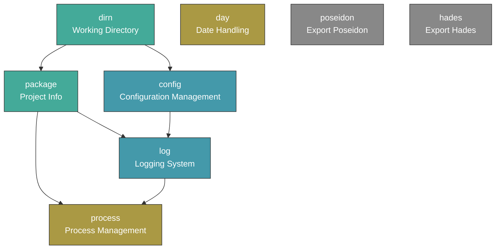

> [!TIP]
> 本文档由 AI 阅读代码后生成。中文版本已经过本人初步审校。英文版本基于中文版本由 AI 翻译生成。如有问题或更好的文档，欢迎提交 Issue。\
> This document is generated by AI after reading the code. The Chinese version has been preliminarily reviewed by the author. The English version is AI-translated based on the Chinese version. If you have any issues or a better version of the documentation, please feel free to submit an Issue.


[简体中文](README.md) | [English](README.en.md)


# @danor-lib/pangu

[](https://opensource.org/license/mit)

Pangu, the cornerstone library for unified initialization of common usage libraries.

`Pangu` uses a unified "initialization configuration specifier" syntax to asynchronously import and initialize common components on demand (configuration management, logging, date handling, process management, etc.). All components are automatically orchestrated according to dependency order, eliminating the need to manually manage initialization timing. When no initialization configuration is passed, `Pangu` loads nothing.

## Design Philosophy

In Node.js projects, it is common to manually import and initialize multiple foundational libraries (such as configuration readers, logging, date libraries, etc.) in the entry file, with dependencies between them. The design goals of `Pangu` are:

- **Declarative configuration** — describe required components and their parameters via a URL-query-style specifier, without writing initialization code.
- **Automatic dependency orchestration** — components have dependencies (e.g., `log` depends on `config`, `config` depends on `dirn`); `Pangu` initializes them in the correct order automatically.
- **Environment space isolation** — the same component can have different instances in different "spaces" without interference.
- **Multi-entry reuse** — repeated `import` statements within the same process share already-initialized component instances, avoiding duplicate initialization.

## Basic Example

```javascript
import { C, G, Day, dirnWorking, PKG } from '@danor-lib/pangu/index.js?config&log&day';

// C: Poseidon configuration instance (corresponds to config component, reads ./config/ by default)
console.log(C.apple);      // data from config.apple.json

// G: Hades logging instance (corresponds to log component)
G.info('Service started', 'Listening port', '✔ ~[port]~{80}');

// Day: initialized dayjs (default Chinese timezone, YYYY-MM-DD HH:mm:ss format)
console.log(Day().format());  // '2026-07-16 14:30:00'

// dirnWorking: absolute path of the working directory
console.log(dirnWorking);

// PKG: content of package.json in the working directory
console.log(PKG.name);
```

> **Note**: The import path must include `/index.js`, otherwise Node.js cannot correctly parse the query parameters in the import specifier.

## Initialization Configuration Specifier

The initialization configuration specifier is the core mechanism of `Pangu`. Its format follows the query part of the URL specification and is parsed using `new URL()`.

### Syntax Rules

```
?{short}[:{alias}][:{space}][.{paramNamed}={value}][={param}]&...
```

| Symbol       | Meaning             | Description                                                                                                            |
| :----------- | :------------------ | :--------------------------------------------------------------------------------------------------------------------- |
| `short`      | Component shorthand | Enables the component. Supported abbreviations: `cfg`/`conf`→`config`, `pkg`→`package`, `dir`→`dirn`, `proc`→`process` |
| `:` (first)  | Component alias     | Sets an alias to initialize multiple components of the same type, e.g., `config:sms`                                   |
| `:` (second) | Environment space   | Specifies a runtime space for the component. Components in different spaces do not interfere with each other           |
| `?` (prefix) | Optional query      | `?short` only returns an already-enabled component with the same name, does not actively initialize                    |
| `=`          | Positional param    | Passes positional arguments; multiple values separated by `,`                                                          |
| `.`          | Named param         | Passes named parameters, e.g., `config.dirn=folder1`. Passing alone does not enable the component                      |
| `\`          | Escape character    | Escapes the special symbols above                                                                                      |

### Syntax Examples

| Specifier                       | Meaning                                                                                                           |
| :------------------------------ | :---------------------------------------------------------------------------------------------------------------- |
| `config`                        | Enables `config` component                                                                                        |
| `config&log`                    | Enables both `config` and `log` components                                                                        |
| `config=db`                     | Enables `config` and passes positional param `db` (as `preloads`)                                                 |
| `config=db,server&log`          | Enables `config` (preloads `db` and `server`) and `log`                                                           |
| `config&config.dirn=folder1`    | Enables `config` and sets `dirn` parameter to `folder1`                                                           |
| `config.dirn=folder1`           | Only passes a parameter, does not enable `config` (must be combined with other means)                             |
| `config:sms`                    | Enables a `config` component named `sms` (alias)                                                                  |
| `config:aaa&config:sms:vvv`     | Enables `config` in space `aaa`, and `config` with alias `sms` in space `vvv`                                     |
| `?config`                       | Only queries an already-enabled `config`, does not actively initialize (for reusing instances from other entries) |
| `log.name=myapp&log.level=info` | Enables `log`, sets log name to `myapp`, level to `info`                                                          |

## Passing Initialization Configuration

`Pangu` supports passing initialization configuration through the following methods, in descending order of priority:

| Method | Source                            | Priority | Use case                                                 |
| :----- | :-------------------------------- | :------- | :------------------------------------------------------- |
| `spc`  | URL query of the import statement | High     | Each JS file explicitly declares its required components |
| `env`  | Environment variable `NENV_PANGU` | Low      | Shared configuration across multiple entries or programs |

### Method 1: Inline Import Parameters (spc)

When Node.js imports ES modules, it resolves the import specifier as a URL. `Pangu` leverages this to extract configuration from the query:

```javascript
// ✅ Correct — must include /index.js
import { C, G } from '@danor-lib/pangu/index.js?config&log';

// ❌ Incorrect — Node.js cannot recognize
import { C, G } from '@danor-lib/pangu?config&log';
```

### Method 2: Environment Variable `NENV_PANGU`

Set the environment variable before starting the program:

```bash
# Linux / macOS
export NENV_PANGU="config&log"

# Windows (cmd)
set NENV_PANGU=config&log

node index.js
```

```javascript
// index.js — no need to specify in import
import { C, G } from '@danor-lib/pangu/index.js';

console.log(C); // Poseidon instance is ready
```

It can also be set at runtime via code (must be executed before importing `pangu`):

```javascript
// index.env.js
process.env.NENV_PANGU = 'dirn&pkg&config&log';

// index.js
import './index.env.js';
import { C, G } from '@danor-lib/pangu/index.js';
```

## Component System

### Component Dependency Graph



- **Green**: Prerequisite components (depended on by others)
- **Blue**: Main components (depend on prerequisite components)
- **Orange**: Independently initialized components
- **Gray**: Pure exports (no initialization, only re-export the library)

### Initialization Order

Components are initialized in the following priority order (smaller numbers execute first):

| Priority | Component  | Description                                              |
| :------- | :--------- | :------------------------------------------------------- |
| 1        | `dirn`     | Determines the working directory                         |
| 2        | `package`  | Reads package.json (depends on dirn)                     |
| 3        | `config`   | Loads configuration (depends on dirn)                    |
| 4        | `log`      | Initializes logging (depends on dirn + package + config) |
| 5        | `process`  | Process management (depends on package + log)            |
| 99       | `day`      | Date handling (no dependencies)                          |
| 99       | `poseidon` | Exports Poseidon class (no dependencies)                 |
| 99       | `hades`    | Exports Hades-related classes (no dependencies)          |

---

## Prerequisite Components

### Working Directory `dirn`

Sets and exports the working directory path. Most components treat this as the root for relative paths.

> `dirn` is short for *directory name* and is consistently used across the @danor-lib family to mean "directory" — its length aligns with `file` and provides good recognizability; it is not a typo.

#### Parameters

| Parameter position   | Source            | Description                                                |
| :------------------- | :---------------- | :--------------------------------------------------------- |
| Positional param 1   | `dirn=path`       | Manually specify the working directory path                |
| Environment variable | `NENV_PANGU_DIRN` | Specify via environment variable                           |
| Fallback             | `process.cwd()`   | Use current working directory if none of the above are set |

#### Special Insertion Values

| Insertion value | Description                                                                         |
| :-------------- | :---------------------------------------------------------------------------------- |
| `<entry>`       | The directory of the program entry file, equal to `path.parse(process.argv[1]).dir` |
| `<cwd>`         | The current environment working directory, equal to `process.cwd()`                 |

> Relative path transformations are supported, e.g., `<cwd>/../map` is equivalent to the `map` folder at the same level as the current working directory.

#### Exported Variables

| Variable       | Type                     | Description                                    |
| :------------- | :----------------------- | :--------------------------------------------- |
| `dirnWorking`  | `string`                 | Absolute path of the default working directory |
| `dirnsWorking` | `Record<string, string>` | Multi-component mapping (keyed by alias)       |

#### Example

```javascript
// Specify working directory
import { dirnWorking } from '@danor-lib/pangu/index.js?dirn=./myapp';

// Use the entry file directory
import { dirnWorking } from '@danor-lib/pangu/index.js?dirn=<entry>';
```

---

### Project Info `package`

Reads the `package.json` file in the working directory. If the file does not exist or fails to parse, returns `{}`.

#### Parameters

| Parameter position | Source                           | Description                                             |
| :----------------- | :------------------------------- | :------------------------------------------------------ |
| Named param dirn   | `package.dirn=path`              | Specifies the directory containing package.json         |
| Positional param 1 | `package=path`                   | Same as dirn                                            |
| Fallback           | `dirn` component's `dirnWorking` | Uses the working directory if none of the above are set |

#### Dependencies

- `dirn` (automatically initialized)

#### Exported Variables

| Variable   | Type                     | Description                              |
| :--------- | :----------------------- | :--------------------------------------- |
| `PKG`      | `object`                 | Default package.json content             |
| `packages` | `Record<string, object>` | Multi-component mapping (keyed by alias) |

#### Example

```javascript
import { PKG } from '@danor-lib/pangu/index.js?package';

console.log(PKG.name);     // Project name
console.log(PKG.version);  // Project version
```

---

## Main Components

### Configuration `config`

Loads [`@danor-lib/poseidon`](https://github.com/danor-lib/poseidon), which by default reads configuration files from `{workingDirectory}/config/`.

#### Parameters

| Parameter position | Source               | Description                                                     |
| :----------------- | :------------------- | :-------------------------------------------------------------- |
| Named param dirn   | `config.dirn=path`   | Specifies the configuration directory                           |
| Positional param   | `config=type1,type2` | Preloads a list of categories (passed to Poseidon's `preloads`) |
| Named param jsonc  | `config.jsonc=true`  | Enables JSONC support (requires the `comment-json` package)     |

#### Dependencies

- `dirn` (automatically initialized)

#### Exported Variables

| Variable  | Type                       | Description                              |
| :-------- | :------------------------- | :--------------------------------------- |
| `C`       | `Poseidon`                 | Default Poseidon configuration instance  |
| `configs` | `Record<string, Poseidon>` | Multi-component mapping (keyed by alias) |

#### Example

```javascript
// Basic usage
import { C } from '@danor-lib/pangu/index.js?config';

// Read configuration
console.log(C.apple);   // data from config.apple.json
console.log(C.host);    // fields expanded from config.json

// Preload specific categories
import { C } from '@danor-lib/pangu/index.js?config=db,server';
```

> For full usage of Poseidon (methods on `C.$` such as `read`, `load`, `save`, `edit`, `selectExistTypes`, etc.), please refer to the [@danor-lib/poseidon documentation](https://github.com/danor-lib/poseidon).

---

### Logging `log`

Loads [`@danor-lib/hades`](https://github.com/danor-lib/hades), which by default outputs logs to `{workingDirectory}/log`.

#### Parameters

| Named parameter          | Description                           | Default value                  |
| :----------------------- | :------------------------------------ | :----------------------------- |
| `name`                   | Log name                              | `PKG.name` (from package.json) |
| `level`                  | Log level                             | /                              |
| `dirn`                   | Log output directory                  | `{workingDirectory}/log`       |
| `eol`                    | End‑of‑line character                 | /                              |
| `templatetime`           | Timestamp template                    | /                              |
| `sizefilelogmax`         | Maximum size of a single log file     | /                              |
| `numberfilelogbackupmax` | Maximum number of backup log files    | /                              |
| `willhighlight`          | Whether to enable highlighting        | /                              |
| `willcolorfullevel`      | Whether to enable level colors        | /                              |
| `willoutputinitinfo`     | Whether to output initialization info | /                              |
| `willconsoleoutputerror` | Whether to output errors to console   | /                              |
| `willinitimmediate`      | Whether to initialize immediately     | /                              |

> For full usage of Hades, please refer to the [@danor-lib/hades documentation](https://github.com/danor-lib/hades).

#### Dependencies

- `dirn` → `package` → `config` (automatically initialized in order)

#### Exported Variables

| Variable | Type                    | Description                                                                                    |
| :------- | :---------------------- | :--------------------------------------------------------------------------------------------- |
| `G`      | `Hades`                 | Default Hades logging instance                                                                 |
| `GG`     | `Hades \| Console`      | Same as `G`; falls back to `globalThis.console` if `log` is not enabled, ensuring availability |
| `logs`   | `Record<string, Hades>` | Multi-component mapping (keyed by alias)                                                       |

#### Example

```javascript
// Basic usage
import { G } from '@danor-lib/pangu/index.js?log';

G.info('Service started', 'Listening port', '✔ ~[port]~{80}');
G.warn('Monitor', 'High memory usage', `${usage}%`);
G.error('Database', 'Connection', '✘ Timeout', error);

// Custom log name and level
import { G } from '@danor-lib/pangu/index.js?log.name=myapp&log.level=debug';
```

---

## Other Components

### Process Management `process`

Performs basic Node.js process setup: sets the process title and catches unhandled Promise rejections.

#### Behavior

- Sets `process.title` to `PKG.name` (from package.json)
- Listens to the `unhandledRejection` event and logs unhandled asynchronous rejections

#### Dependencies

- `package` → `log` (automatically initialized in order)

#### Exported Variables

| Variable  | Type             | Description              |
| :-------- | :--------------- | :----------------------- |
| `process` | `NodeJS.Process` | Node.js process instance |

#### Example

```javascript
import { process } from '@danor-lib/pangu/index.js?process';

console.log(process.title);  // Has been set to the project name
```

---

### Date Handling `day`

Initializes [`dayjs`](https://day.js.org) with convenient defaults.

#### Initialization Behavior

- Loads the `customParseFormat` plugin
- Sets the default language to `zh-cn` (Chinese)
- Sets the default format template `defaultFormat = 'YYYY-MM-DD HH:mm:ss'`
- Overrides `format()`: when called without arguments, it automatically uses `defaultFormat`

#### Exported Variables

| Variable | Type           | Description              |
| :------- | :------------- | :----------------------- |
| `Day`    | `typeof dayjs` | Initialized dayjs object |

#### Example

```javascript
import { Day } from '@danor-lib/pangu/index.js?day';

console.log(Day().format());          // '2026-07-16 14:30:00'
console.log(Day('2026-01-01').format('YYYY/MM/DD'));  // '2026/01/01'
```

---

## Exported Related Libraries

The following components do not perform any initialization; they simply re‑expose the corresponding library exports for convenient unified importing from `pangu`:

| Component  | Exported Variable | Corresponding Library                                          |
| :--------- | :---------------- | :------------------------------------------------------------- |
| `poseidon` | `Poseidon`        | [`@danor-lib/poseidon`](https://github.com/danor-lib/poseidon) |
| `hades`    | `Hades`           | [`@danor-lib/hades`](https://github.com/danor-lib/hades)       |
| `hades`    | `Melinoe`         | `Melinoe` from `@danor-lib/hades`                              |
| `hades`    | `Zagreus`         | `Zagreus` from `@danor-lib/hades`                              |

```javascript
import { Poseidon, Hades, Melinoe, Zagreus } from '@danor-lib/pangu/index.js?hades';

// Manually create a Poseidon instance
const myConfig = new Poseidon({ dirn: './custom-config' });

// Manually create a Hades instance
const myLogger = new Hades({ name: 'custom' });
```

---

## Exported Variables Overview

| Export Name    | Type                       | Component  | Description                               |
| :------------- | :------------------------- | :--------- | :---------------------------------------- |
| `dirnWorking`  | `string`                   | `dirn`     | Absolute path of the working directory    |
| `dirnsWorking` | `Record<string, string>`   | `dirn`     | Multi‑component working directory mapping |
| `PKG`          | `object`                   | `package`  | package.json content                      |
| `packages`     | `Record<string, object>`   | `package`  | Multi‑component package mapping           |
| `C`            | `Poseidon`                 | `config`   | Poseidon configuration instance           |
| `configs`      | `Record<string, Poseidon>` | `config`   | Multi‑component configuration mapping     |
| `G`            | `Hades`                    | `log`      | Hades logging instance                    |
| `GG`           | `Hades \| Console`         | `log`      | Logging instance (with Console fallback)  |
| `logs`         | `Record<string, Hades>`    | `log`      | Multi‑component log mapping               |
| `process`      | `NodeJS.Process`           | `process`  | Node.js process instance                  |
| `Day`          | `typeof dayjs`             | `day`      | Initialized dayjs                         |
| `Poseidon`     | `typeof Poseidon`          | `poseidon` | Poseidon class                            |
| `Hades`        | `typeof Hades`             | `hades`    | Hades class                               |
| `Melinoe`      | `typeof Melinoe`           | `hades`    | Melinoe class                             |
| `Zagreus`      | `typeof Zagreus`           | `hades`    | Zagreus class                             |

---

## Advanced Features

### 1. Component Alias

Using `:` to set an alias allows initializing multiple components of the same type within the same process:

```javascript
// Initialize two independent Poseidon configuration instances
import { configs } from '@danor-lib/pangu/index.js?config&config:sms.dirn=./sms-config';

const mainConfig = configs[''];    // default config, reads ./config/
const smsConfig = configs['sms'];  // alias sms, reads ./sms-config/
```

Similarly, `dirn`, `package`, and `log` also support aliases:

```javascript
import { dirnsWorking, packages, logs } from '@danor-lib/pangu/index.js?dirn:app1=./app1&dirn:app2=./app2&package:app1&package:app2';
```

### 2. Environment Space

Using the second `:` to set an environment space gives components different runtime contexts. Components of the same type in different spaces have independent dependency chains:

```javascript
// Initialize the full chain in the "admin" space
import { C } from '@danor-lib/pangu/index.js?dirn:default:admin=./admin&config:default:admin';

// In another entry, another space
import { C } from '@danor-lib/pangu/index.js?dirn:default:api=./api&config:default:api';
```

### 3. Multi-entry Instance Sharing

`Pangu` uses `globalThis.$pangu` to store global state. Repeated `import` statements within the same process automatically share already-initialized component instances:

```javascript
// entry-a.js
import { C, G } from '@danor-lib/pangu/index.js?dirn&config&log';
// Initializes dirn → config → log

// entry-b.js (same process)
import { G } from '@danor-lib/pangu/index.js?log';
// Directly reuses the already-initialized G, no duplicate initialization
```

Using the `?` prefix only queries already-enabled components without active initialization:

```javascript
// Only obtains an already-initialized config (if exists), does not actively enable
import { C } from '@danor-lib/pangu/index.js??config';
```

### 4. `GG` — Logging with Fallback

`GG` points to the same Hades instance as `G`, but when the `log` component is not enabled at all, `GG` falls back to `globalThis.console`, ensuring logging calls are always safe:

```javascript
// log component not enabled
import { GG } from '@danor-lib/pangu/index.js';

GG.info('This log is output via console.info');  // No error
```

### 5. Component Abbreviations

For convenience, `Pangu` provides built-in abbreviations for commonly used components:

| Abbreviation | Full name |
| :----------- | :-------- |
| `dir`        | `dirn`    |
| `pkg`        | `package` |
| `cfg`        | `config`  |
| `conf`       | `config`  |
| `logger`     | `log`     |
| `proc`       | `process` |

```javascript
// The following two are equivalent
import { C } from '@danor-lib/pangu/index.js?cfg&log';
import { C } from '@danor-lib/pangu/index.js?config&log';
```

---

## Environment Variable Reference

| Environment Variable | Description                                                          |
| :------------------- | :------------------------------------------------------------------- |
| `NENV_PANGU`         | Initialization configuration specifier (same format as import query) |
| `NENV_PANGU_DIRN`    | Working directory (third‑priority source for the `dirn` component)   |

---

## Relationship with Poseidon / Hades

`Pangu` is the upper‑level orchestration library for [`@danor-lib/poseidon`](https://github.com/danor-lib/poseidon) and [`@danor-lib/hades`](https://github.com/danor-lib/hades):

```
@danor-lib/pangu
├── @danor-lib/poseidon  →  Configuration management (config component)
├── @danor-lib/hades     →  Logging system (log component)
└── dayjs                →  Date handling (day component)
```

- **Poseidon** handles categorized data file management and read‑only access.
- **Hades** handles structured log output and storage.
- **Pangu** orchestrates them (and other common libraries) in the correct order and provides a unified import entry.
