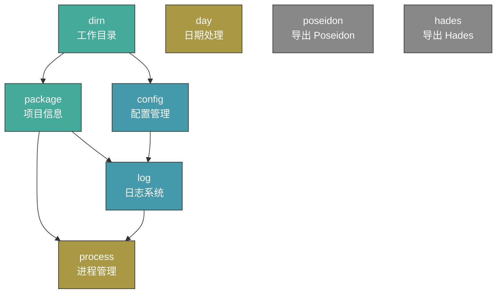

> [!TIP]
> 本文档由 AI 阅读代码后生成。中文版本已经过本人初步审校。英文版本基于中文版本由 AI 翻译生成。如有问题或更好的文档，欢迎提交 Issue。\
> This document is generated by AI after reading the code. The Chinese version has been preliminarily reviewed by the author. The English version is AI-translated based on the Chinese version. If you have any issues or a better version of the documentation, please feel free to submit an Issue.


[简体中文](README.md) | [English](README.en.md)


# @danor-lib/pangu

[](https://opensource.org/license/mit)

盘古，统一初始化常用库的基石库。\
Pangu, the cornerstone library for unified initialization of common usage libraries.

`Pangu` 通过一套统一的"初始化配置说明符"语法，按需异步导入并初始化常用组件（配置管理、日志系统、日期处理、进程管理等）。所有组件按依赖顺序自动编排，无需手动管理初始化时序。不传递任何初始化配置时，`Pangu` 不会加载任何东西。

## 设计理念

在 Node.js 项目中，通常需要在入口文件手动引入并初始化多个基础库（如配置读取、日志系统、日期库等），且各库之间存在依赖顺序。`Pangu` 的设计目标是：

- **声明式配置** — 通过 URL query 风格的说明符描述需要哪些组件及其参数，无需编写初始化代码。
- **自动依赖编排** — 组件之间存在依赖关系（如 `log` 依赖 `config`，`config` 依赖 `dirn`），`Pangu` 自动按正确顺序初始化。
- **环境空间隔离** — 同一组件可在不同"空间"下拥有不同实例，互不干扰。
- **多入口复用** — 同一进程中多次 `import` 会共享已初始化的组件实例，避免重复初始化。

## 基础示例

```javascript
import '@danor-lib/pangu/index.js?config&log&day';
import { C, G, Day, dirnWorking, PKG } from '@danor-lib/pangu';
// 推荐第一行负责初始化，第二行负责导入。以便 VSCode 等编辑器能够正确提供智能提示。

// C: Poseidon 配置实例（对应 config 组件，默认读取 ./config/ 目录）
console.log(C.apple);      // config.apple.json 的数据

// G: Hades 日志实例（对应 log 组件）
G.info('服务启动', '监听端口', '✔ ~[端口]~{80}');

// Day: 初始化好的 dayjs（默认中文时区、YYYY-MM-DD HH:mm:ss 格式）
console.log(Day().format());  // '2026-07-16 14:30:00'

// dirnWorking: 工作目录绝对路径
console.log(dirnWorking);

// PKG: 工作目录下的 package.json 内容
console.log(PKG.name);
```

> **注意**：导入路径中必须包含 `/index.js`，否则 Node.js 无法正确解析 import 说明符中的 query 参数。

## 初始化配置说明符

初始化配置说明符是 `Pangu` 的核心机制，格式遵循 URL 规范中的 query 部分，使用 `new URL()` 进行解析。

### 语法规则

```
?{short}[:{alias}][:{space}][.{paramNamed}={value}][={param}]&...
```

| 符号         | 含义     | 说明                                                                                         |
| :----------- | :------- | :------------------------------------------------------------------------------------------- |
| `short`      | 组件简称 | 启用该组件。支持缩写：`cfg`/`conf`→`config`、`pkg`→`package`、`dir`→`dirn`、`proc`→`process` |
| `:` (第一个) | 组件别名 | 设置别名可初始化多个同类型组件，如 `config:sms`                                              |
| `:` (第二个) | 环境空间 | 为组件指定运行空间。不同空间的组件互不干扰                                                   |
| `?` (前缀)   | 可选查询 | `?short` 只返回已启用的同名组件，不会主动初始化                                              |
| `=`          | 默认参数 | 传递位置参数，多个用 `,` 分隔                                                                |
| `.`          | 具名参数 | 传递具名参数，如 `config.dirn=folder1`。单独传递不会启用组件                                 |
| `\`          | 转义符   | 对上述特殊符号进行转义                                                                       |

### 语法示例

| 说明符                          | 含义                                                                    |
| :------------------------------ | :---------------------------------------------------------------------- |
| `config`                        | 启用 `config` 组件                                                      |
| `config&log`                    | 启用 `config` 和 `log` 组件                                             |
| `config=db`                     | 启用 `config`，并传递默认参数 `db`（作为 `preloads`）                   |
| `config=db,server&log`          | 启用 `config`（预加载 `db` 和 `server`）和 `log`                        |
| `config&config.dirn=folder1`    | 启用 `config`，并设置 `dirn` 参数为 `folder1`                           |
| `config.dirn=folder1`           | 仅传递参数，不启用 `config`（需配合其他方式启用）                       |
| `config:sms`                    | 启用名为 `sms` 的 `config` 组件（别名）                                 |
| `config:aaa&config:sms:vvv`     | 在 `aaa` 空间启用 `config`，在 `vvv` 空间启用名为 `sms` 的 `config`     |
| `?config`                       | 仅查询已启用的 `config`，不主动初始化（用于获取其他入口已初始化的实例） |
| `log.name=myapp&log.level=info` | 启用 `log`，设置日志名称为 `myapp`，级别为 `info`                       |

## 传递初始化配置

`Pangu` 支持通过以下方式传递初始化配置，优先级从高到低：

| 方式  | 来源                    | 优先级 | 适用场景                     |
| :---- | :---------------------- | :----- | :--------------------------- |
| `spc` | import 语句的 URL query | 高     | 每个 JS 文件明确声明所需组件 |
| `env` | 环境变量 `DR_PANGU`     | 低     | 多个入口或程序之间的共有配置 |

### 方式一：import 内联参数（spc）

Node.js 导入 ES 模块时会将导入说明符解析为 URL，`Pangu` 利用此机制从 query 中提取配置：

```javascript
// ✅ 正确 —— 必须包含 /index.js
import { C, G } from '@danor-lib/pangu/index.js?config&log';

// ❌ 错误 —— Node.js 无法识别
import { C, G } from '@danor-lib/pangu?config&log';
```

### 方式二：环境变量 `DR_PANGU`

在启动程序前设置环境变量：

```bash
# Linux / macOS
export DR_PANGU="config&log"

# Windows (cmd)
set DR_PANGU=config&log

node index.js
```

```javascript
// index.js —— 无需在 import 中指定
import { C, G } from '@danor-lib/pangu/index.js';

console.log(C); // Poseidon 实例已就绪
```

也可以通过代码在运行时设置（需在 import `pangu` 之前执行）：

```javascript
// index.env.js
process.env.DR_PANGU = 'dirn&pkg&config&log';

// index.js
import './index.env.js';
import { C, G } from '@danor-lib/pangu/index.js';
```

## 组件体系

### 组件依赖图



- **绿色**：前置组件（被其他组件依赖）
- **蓝色**：主要组件（依赖前置组件）
- **橙色**：独立初始化组件
- **灰色**：纯导出（不初始化，仅 re-export 库）

### 初始化顺序

组件按以下优先级顺序初始化（数字越小越先执行）：

| 优先级 | 组件       | 说明                                       |
| :----- | :--------- | :----------------------------------------- |
| 1      | `dirn`     | 确定工作目录                               |
| 2      | `package`  | 读取 package.json（依赖 dirn）             |
| 3      | `config`   | 加载配置（依赖 dirn）                      |
| 4      | `log`      | 初始化日志（依赖 dirn + package + config） |
| 5      | `process`  | 进程管理（依赖 package + log）             |
| 99     | `day`      | 日期处理（无依赖）                         |
| 99     | `poseidon` | 导出 Poseidon 类（无依赖）                 |
| 99     | `hades`    | 导出 Hades 相关类（无依赖）                |

---

## 前置组件

### 工作目录 `dirn`

设置并导出工作目录路径。大多数组件将其作为相对路径的根目录。

> `dirn` 是 *directory name* 的缩写，在 @danor-lib 系列库中统一用作"目录"之意——长度与 `file` 对齐且具有一定辨识度，并非拼写错误。

#### 参数

| 参数位置   | 来源            | 说明                           |
| :--------- | :-------------- | :----------------------------- |
| 默认参数 1 | `dirn=路径`     | 手动指定工作目录路径           |
| 环境变量   | `DR_PANGU_DIRN` | 通过环境变量指定               |
| 回退值     | `process.cwd()` | 以上均未设置时使用当前工作目录 |

#### 特殊插入值

| 插入值    | 说明                                                         |
| :-------- | :----------------------------------------------------------- |
| `<entry>` | 程序入口文件所在目录，等于 `path.parse(process.argv[1]).dir` |
| `<cwd>`   | 当前环境工作目录，等于 `process.cwd()`                       |

> 支持相对路径变换，如 `<cwd>/../map` 等价于当前工作目录同级的 `map` 文件夹。

#### 导出变量

| 变量           | 类型                     | 说明                     |
| :------------- | :----------------------- | :----------------------- |
| `dirnWorking`  | `string`                 | 默认工作目录的绝对路径   |
| `dirnsWorking` | `Record<string, string>` | 多组件映射（key 为别名） |

#### 示例

```javascript
// 指定工作目录
import { dirnWorking } from '@danor-lib/pangu/index.js?dirn=./myapp';

// 使用程序入口目录
import { dirnWorking } from '@danor-lib/pangu/index.js?dirn=<entry>';
```

---

### 项目信息 `package`

读取工作目录下的 `package.json` 文件内容。若文件不存在或解析失败，返回 `{}`。

#### 参数

| 参数位置      | 来源                        | 说明                       |
| :------------ | :-------------------------- | :------------------------- |
| 具名参数 dirn | `package.dirn=路径`         | 指定 package.json 所在目录 |
| 默认参数 1    | `package=路径`              | 同 dirn                    |
| 回退值        | `dirn` 组件的 `dirnWorking` | 以上均未设置时使用工作目录 |

#### 依赖

- `dirn`（自动初始化）

#### 导出变量

| 变量       | 类型                     | 说明                     |
| :--------- | :----------------------- | :----------------------- |
| `PKG`      | `object`                 | 默认 package.json 内容   |
| `packages` | `Record<string, object>` | 多组件映射（key 为别名） |

#### 示例

```javascript
import { PKG } from '@danor-lib/pangu/index.js?package';

console.log(PKG.name);     // 项目名称
console.log(PKG.version);  // 项目版本
```

---

## 主要组件

### 配置 `config`

加载 [`@danor-lib/poseidon`](https://github.com/danor-lib/poseidon)，默认读取 `{工作目录}/config/` 目录下的配置文件。

#### 参数

| 参数位置       | 来源                 | 说明                                            |
| :------------- | :------------------- | :---------------------------------------------- |
| 具名参数 dirn  | `config.dirn=路径`   | 指定配置文件目录                                |
| 默认参数       | `config=type1,type2` | 预加载的分类列表（传给 Poseidon 的 `preloads`） |
| 具名参数 jsonc | `config.jsonc=true`  | 启用 JSONC 支持（需安装 `comment-json` 包）     |

#### 依赖

- `dirn`（自动初始化）

#### 导出变量

| 变量      | 类型                       | 说明                     |
| :-------- | :------------------------- | :----------------------- |
| `C`       | `Poseidon`                 | 默认 Poseidon 配置实例   |
| `configs` | `Record<string, Poseidon>` | 多组件映射（key 为别名） |

#### 示例

```javascript
// 基础用法
import { C } from '@danor-lib/pangu/index.js?config';

// 读取配置
console.log(C.apple);   // config.apple.json 的数据
console.log(C.host);    // config.json 中展开的字段

// 预加载指定分类
import { C } from '@danor-lib/pangu/index.js?config=db,server';
```

> 关于 Poseidon 的完整用法（`C.$` 上的 `read`、`load`、`save`、`edit`、`selectExistTypes` 等方法），请参阅 [@danor-lib/poseidon 文档](https://github.com/danor-lib/poseidon)。

---

### 日志 `log`

加载 [`@danor-lib/hades`](https://github.com/danor-lib/hades)，默认将日志输出到 `{工作目录}/log` 目录。

#### 参数

| 具名参数                 | 说明                 | 默认值                                  |
| :----------------------- | :------------------- | :-------------------------------------- |
| `name`                   | 日志名称             | `PKG.name`（package.json 的 name 字段） |
| `level`                  | 日志级别             | /                                       |
| `dirn`                   | 日志输出目录         | `{工作目录}/log`                        |
| `eol`                    | 行尾符               | /                                       |
| `templateTime`           | 时间戳模板           | /                                       |
| `sizeFileLogMax`         | 单个日志文件最大大小 | /                                       |
| `numberFileLogBackupMax` | 日志备份文件最大数量 | /                                       |
| `willHighlight`          | 是否启用高亮         | /                                       |
| `willColorfulLevel`      | 是否启用级别颜色     | /                                       |
| `willOutputInitInfo`     | 是否输出初始化信息   | /                                       |
| `willConsoleOutputError` | 是否在控制台输出错误 | /                                       |
| `willInitImmediate`      | 是否立即初始化       | /                                       |

> 关于 Hades 的完整用法，请参阅 [@danor-lib/hades 文档](https://github.com/danor-lib/hades)。

#### 依赖

- `dirn` → `package` → `config`（自动按序初始化）

#### 导出变量

| 变量   | 类型                    | 说明                                                               |
| :----- | :---------------------- | :----------------------------------------------------------------- |
| `G`    | `Hades`                 | 默认 Hades 日志实例                                                |
| `GG`   | `Hades \| Console`      | 同 `G`；若 `log` 未启用则降级为 `globalThis.console`，保证始终可用 |
| `logs` | `Record<string, Hades>` | 多组件映射（key 为别名）                                           |

#### 示例

```javascript
// 基础用法
import { G } from '@danor-lib/pangu/index.js?log';

G.info('服务启动', '监听端口', '✔ ~[端口]~{80}');
G.warn('监控', '内存使用率过高', `${usage}%`);
G.error('数据库', '连接', '✘ 连接超时', error);

// 自定义日志名称和级别
import { G } from '@danor-lib/pangu/index.js?log.name=myapp&log.level=debug';
```

---

## 其他组件

### 进程管理 `process`

对 Node.js 进程进行基础设置：设定进程标题、捕获未处理的 Promise 拒绝。

#### 行为

- 将 `process.title` 设置为 `PKG.name`（package.json 的 name 字段）
- 监听 `unhandledRejection` 事件，通过日志记录未处理的异步拒绝

#### 自定义文本

日志中输出的中文文本可通过环境变量 `DR_PANGU_TEXTS` 以 JSON 格式覆盖：

```bash
export DR_PANGU_TEXTS='{"process":"进程","unhandledRejection":"未处理的拒绝","unhandledAsyncRejection":"未处理的异步拒绝"}'
```

| 键                        | 默认值             | 说明                        |
| :------------------------ | :----------------- | :-------------------------- |
| `process`                 | `进程`             | 进程相关日志的分类标签      |
| `unhandledRejection`      | `未处理的拒绝`     | 同步 Promise 拒绝的日志描述 |
| `unhandledAsyncRejection` | `未处理的异步拒绝` | 异步 Promise 拒绝的日志描述 |

> 若环境变量未设置或 JSON 解析失败，则使用上表中的默认值。

#### 依赖

- `package` → `log`（自动按序初始化）

#### 导出变量

| 变量      | 类型             | 说明             |
| :-------- | :--------------- | :--------------- |
| `process` | `NodeJS.Process` | Node.js 进程实例 |

#### 示例

```javascript
import { process } from '@danor-lib/pangu/index.js?process';

console.log(process.title);  // 已设置为项目名称
```

---

### 日期处理 `day`

对 [`dayjs`](https://day.js.org) 进行符合使用习惯的初始化。

#### 初始化行为

- 加载 `customParseFormat` 插件
- 设置默认语言为 `zh-cn`（中文）
- 设置默认格式化模板 `defaultFormat = 'YYYY-MM-DD HH:mm:ss'`
- 重写 `format()` 方法：无参数时自动使用 `defaultFormat`

#### 导出变量

| 变量  | 类型           | 说明                  |
| :---- | :------------- | :-------------------- |
| `Day` | `typeof dayjs` | 初始化后的 dayjs 对象 |

#### 示例

```javascript
import { Day } from '@danor-lib/pangu/index.js?day';

console.log(Day().format());          // '2026-07-16 14:30:00'
console.log(Day('2026-01-01').format('YYYY/MM/DD'));  // '2026/01/01'
```

---

## 导出相关库

以下组件不会进行任何初始化操作，仅将对应库的导出重新暴露，方便统一从 `pangu` 导入：

| 组件       | 导出变量   | 对应库                                                         |
| :--------- | :--------- | :------------------------------------------------------------- |
| `poseidon` | `Poseidon` | [`@danor-lib/poseidon`](https://github.com/danor-lib/poseidon) |
| `hades`    | `Hades`    | [`@danor-lib/hades`](https://github.com/danor-lib/hades)       |
| `hades`    | `Melinoe`  | `@danor-lib/hades` 中的 `Melinoe`                              |
| `hades`    | `Zagreus`  | `@danor-lib/hades` 中的 `Zagreus`                              |

```javascript
import { Poseidon, Hades, Melinoe, Zagreus } from '@danor-lib/pangu/index.js?hades';

// 手动创建 Poseidon 实例
const myConfig = new Poseidon({ dirn: './custom-config' });

// 手动创建 Hades 实例
const myLogger = new Hades({ name: 'custom' });
```

---

## 导出变量一览

| 导出名         | 类型                       | 对应组件   | 说明                        |
| :------------- | :------------------------- | :--------- | :-------------------------- |
| `dirnWorking`  | `string`                   | `dirn`     | 工作目录绝对路径            |
| `dirnsWorking` | `Record<string, string>`   | `dirn`     | 多组件工作目录映射          |
| `PKG`          | `object`                   | `package`  | package.json 内容           |
| `packages`     | `Record<string, object>`   | `package`  | 多组件 package 映射         |
| `C`            | `Poseidon`                 | `config`   | Poseidon 配置实例           |
| `configs`      | `Record<string, Poseidon>` | `config`   | 多组件配置映射              |
| `G`            | `Hades`                    | `log`      | Hades 日志实例              |
| `GG`           | `Hades \| Console`         | `log`      | 日志实例（带 Console 降级） |
| `logs`         | `Record<string, Hades>`    | `log`      | 多组件日志映射              |
| `process`      | `NodeJS.Process`           | `process`  | Node.js 进程实例            |
| `Day`          | `typeof dayjs`             | `day`      | 初始化后的 dayjs            |
| `Poseidon`     | `typeof Poseidon`          | `poseidon` | Poseidon 类                 |
| `Hades`        | `typeof Hades`             | `hades`    | Hades 类                    |
| `Melinoe`      | `typeof Melinoe`           | `hades`    | Melinoe 类                  |
| `Zagreus`      | `typeof Zagreus`           | `hades`    | Zagreus 类                  |

---

## 高级特性

### 1. 组件别名（Alias）

通过 `:` 设置别名，可以在同一进程中初始化多个同类型组件：

```javascript
// 初始化两个独立的 Poseidon 配置实例
import { configs } from '@danor-lib/pangu/index.js?config&config:sms.dirn=./sms-config';

const mainConfig = configs[''];    // 默认 config，读取 ./config/
const smsConfig = configs['sms'];  // 别名 sms，读取 ./sms-config/
```

类似的，`dirn`、`package`、`log` 也都支持别名：

```javascript
import { dirnsWorking, packages, logs } from '@danor-lib/pangu/index.js?dirn:app1=./app1&dirn:app2=./app2&package:app1&package:app2';
```

### 2. 环境空间（Space）

通过第二个 `:` 设置环境空间，可以为组件指定不同的运行上下文。不同空间的同类型组件依赖链互不干扰：

```javascript
// 在 "admin" 空间初始化完整链路
import { C } from '@danor-lib/pangu/index.js?dirn:default:admin=./admin&config:default:admin';

// 在另一入口、另一空间
import { C } from '@danor-lib/pangu/index.js?dirn:default:api=./api&config:default:api';
```

### 3. 多入口共享实例

`Pangu` 使用 `globalThis.$pangu` 存储全局状态。同一进程中多次 `import` 会自动共享已初始化的组件实例：

```javascript
// entry-a.js
import { C, G } from '@danor-lib/pangu/index.js?dirn&config&log';
import 'lib/func.js';
// 初始化 dirn → config → log

// lib/func.js（同一进程）
import { G } from '@danor-lib/pangu';
// 直接复用已初始化的 G，不会重复初始化。且可以不写`/index.js`
```

更推荐的写法：
```javascript
// entry-a.js
import '@danor-lib/pangu/index.js?dirn&config&log';
import { C, G } from '@danor-lib/pangu';
import 'lib/func.js';
// 第一行负责初始化，第二行负责导入。以便 VSCode 等编辑器能够正确提供智能提示。

// lib/func.js（同一进程）
import { C, G } from '@danor-lib/pangu';
// 直接复用已初始化的 G，不会重复初始化。且可以不写`/index.js`
```

使用 `?` 前缀可以仅查询已启用的组件而不主动初始化：

```javascript
// 仅获取已初始化的 config（如果存在），不主动启用
import { C } from '@danor-lib/pangu/index.js??config';
```

### 4. `GG` — 带降级的日志引用

`GG` 与 `G` 指向同一个 Hades 实例，但当 `log` 组件完全未启用时，`GG` 会降级为 `globalThis.console`，确保日志调用始终可用：

```javascript
// 未启用 log 组件
import { GG } from '@danor-lib/pangu/index.js';

GG.info('这条日志通过 console.info 输出');  // 不会报错
```

### 5. 组件缩写

为方便书写，`Pangu` 内置了常用组件的缩写映射：

| 缩写     | 完整名称  |
| :------- | :-------- |
| `dir`    | `dirn`    |
| `pkg`    | `package` |
| `cfg`    | `config`  |
| `conf`   | `config`  |
| `logger` | `log`     |
| `proc`   | `process` |

```javascript
// 以下两种写法等价
import { C } from '@danor-lib/pangu/index.js?cfg&log';
import { C } from '@danor-lib/pangu/index.js?config&log';
```

---

## 环境变量参考

| 环境变量         | 说明                                       |
| :--------------- | :----------------------------------------- |
| `DR_PANGU`       | 初始化配置说明符（与 import query 同格式） |
| `DR_PANGU_DIRN`  | 工作目录（`dirn` 组件的第三优先级来源）    |
| `DR_PANGU_TEXTS` | 自定义 `process` 组件日志文本（JSON 格式） |

---

## 与 Poseidon / Hades 的关系

`Pangu` 是 [`@danor-lib/poseidon`](https://github.com/danor-lib/poseidon) 和 [`@danor-lib/hades`](https://github.com/danor-lib/hades) 的上层编排库：

```
@danor-lib/pangu
├── @danor-lib/poseidon  →  配置管理（config 组件）
├── @danor-lib/hades     →  日志系统（log 组件）
└── dayjs                →  日期处理（day 组件）
```

- **Poseidon** 负责数据文件的分类管理与只读访问。
- **Hades** 负责结构化日志的输出与存储。
- **Pangu** 负责将它们（以及其他常用库）按正确顺序初始化，并提供统一的导入入口。
